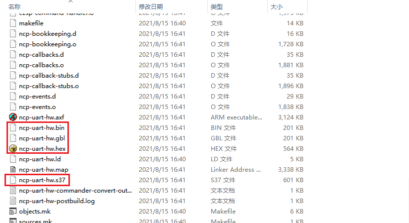

# 0 

# 1 前言

我们在使用 `Simplicity Studio`开发项目时，在工程编译结束后会得到几种固件：`.s37`、`.gbl`、`.hex` 和 `.bin`，如下：

那么这几种固件的区别在哪？如何正确使用它们？

# 2 .bin 文件

`.bin` 文件是一个二进制镜像。它包含一个字节一个字节的镜像，可以烧录到芯片的任何地址。

# 3 .s37 文件

`.s37` 文件是标准 `Motorol S-Record` 格式的 `ASCII` 文件[参阅](http://en.wikipedia.org/wiki/S_record)。它包含已编译固件的编程数据（无论是 `app` 固件或者是 `bootloader ` 固件）和加载工具的一些原始数据。在 `Ember` 开发中，一个 `.s37` 文件通常只代表一个固件（`bootloader`程序 或者 `app` 程序），它们类似于二进制文件，但它们包含了烧录地址，因此，在烧录固件的时候可以直接烧录 `.s37` 固件而无需像 `.bin` 文件那样指定烧录地址。

# 4 .gbl 文件

`.gbl` 文件是 `Gecko Bootloader` 数据文件的专有的二级制格式文件。可以通过 `commander` 工具将 `.s37` 文件转换为 `.gbl` 文件，以便将其传输（串行/`OTA`）到一个 已经烧录了`bootloader` 程序固件的芯片上。`.gbl` 文件包含有关固件预期使用的 `bootloader` 程序或内存映射的信息；这些文件（在大小和内容上）与被放入目标芯片的实际数据非常相似，尽管其中仍有额外的原始数据可供 `bootloader` 程序用于对 `image` 进行适当的编程。由于这些文件的目的在于由 `Ember bootloader` 程序使用，因此这个文件格式仅用于 `app` 程序固件，而不是 `bootloader` 程序固件。在进行串口 `OTA` 或者生成 `.ota` 文件时都需要使用这个格式的文件。更多信息请参考[UG266: Silicon Labs Gecko Bootloader User’s Guide](https://www.silabs.com/documents/public/user-guides/ug266-gecko-bootloader-user-guide.pdf)

# 5 .hex文件

`.hex` 文件是标准的 `Intel HEX`，是一种以 `ASCII` 文本形式表达二进制信息的文件格式[参阅](https://en.wikipedia.org/wiki/Intel_HEX)。这些 `ASCII` 文本文件包含将在目标芯片上的什么位置编程的数据的记录。这可以包含 `app` 程序固件、`bootloader` 程序固件甚至制造商 `token` 和 `SimEEPROM token` 数据的编程数据。这是用户将芯片的内容读出到文件时使用的数据格式。在 `Ember` 开发中，通常将 `hex` 文件作为最终烧录到芯片的文件格式，该文件包含一次加载芯片所需的所有必要信息（`app` 程序固件和任何必要的 `bootloader` 程序固件）。这些类似于二进制文件，但它们也包含烧写到芯片 `flash` 的地址。

# 6 不同文件之间的转换

待补充。。。

# 7 参考整理自

[参考1](https://community.silabs.com/s/article/what-is-the-difference-between-s37-files-ebl-files-and-hex-files-x?language=en_US)

[参考2](https://www.sekorm.com/news/65106043.html)
